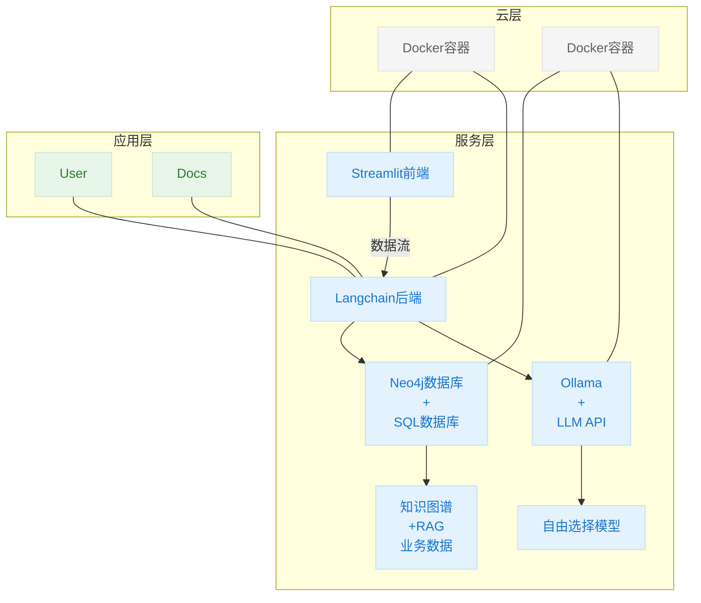
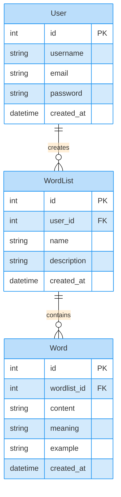
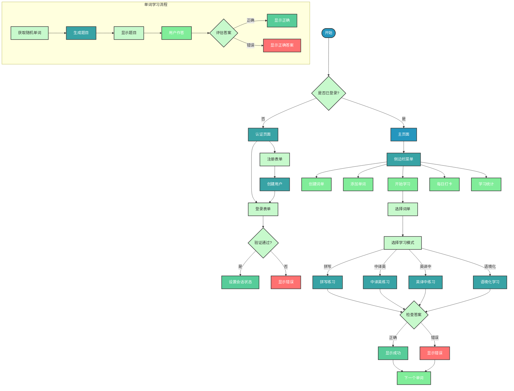
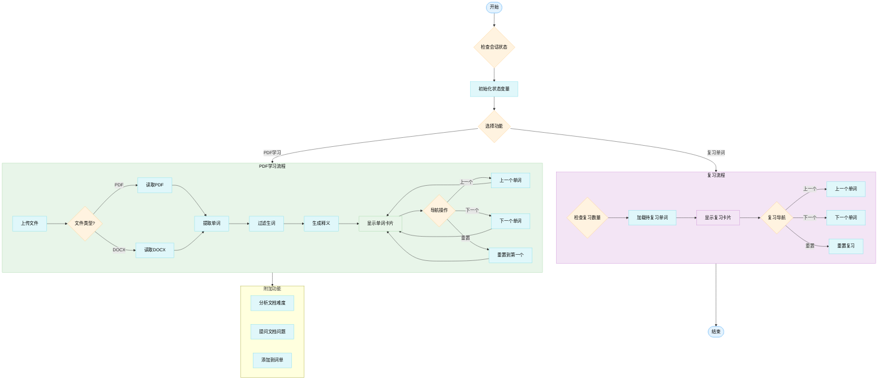

# WordWise

## 项目背景

### 市场痛点

背单词软件一直是市面上教育应用中的重要品类,但目前市面上的传统软件,例如欧陆词典在当今时代已经显得很落后.「前大模型时代」的传统软件的问题主要在于

- 学习过程单调,重复,机械,基本只是单纯的让用户选择正确答案
- 缺乏和「老师」的互动,无法从学习过程中即时得到反馈

而大模型正可以解决上述的两点弊病.通过用户和大模型的对话,大模型可以在用户学习过程中给予即时反馈,引导用户学习.并且对于大模型来说,它的「题库」是无限的,它可以自己出题,而不是传统软件的固定题目,从而可以减少用户长期学习过程中的倦怠感.

基于对这两个问题的改进,用LLM来背单词在网络上备受追捧.然而,这不代表通用的大模型,如**ChatGPT**就可以直接替代传统背单词软件,他们的问题在于它缺乏特定目的的学习资源.因为在现实世界中,大多数用户不是漫无目的的学习的,而是带着特定需求学习的,例如准备四六级考试等;大模型无法直接提供针对性的帮助.举一个简单的例子,我们问**ChatGPT**让他检测一下我是否认识六级范围内的难词,我们发现他给的词可能是perfunctory这样虽然确实难,但已经超出了六级范围的词.

因此,我们的目的就是融合这两种软件的长处,打造一个既可以通过和LLM对话来**互动式**学习,又可以利用考试特定资源来**针对性**学习的平台;同时记录用户的学习记录,规划用户后续的背单词计划,提供长期**个性化**学习,这也是通用性LLM无法做到的.

### 社会价值

我们的选题对我们来说既是机遇也是挑战.一方面,市场上在这方面已经有了大量的产品,我们想要做出一款标新立异的产品无疑难度很大.但另一方面,我们也的确观察到了市场上现有解决方案的问题,综合考虑之下我们敲定了这个主题.这也是考虑到了这个选题的社会价值,现实的逻辑很简单,在现在这样成熟的市场里,如果一个产品的受众真的足够广泛,社会规模足够大,那这个领域必然已经有了非常多的竞争者,因此我们以广大怀揣各种目的的英语学习者为目标群体,没有选择去逃避这个问题,而是尝试去挑战自我.这也是推动我们后续继续开发,甚至尝试商业化落地的基石.

## 设计思路

基于上述需求,我们在实现过程中需要利用的关键技术是**RAG**以及专用数据库的构建,从而让大模型通过检索数据库内先前准备好的内容来实现领域特定的回答.同时,我们利用**Docker**容器来实现项目各板块的快速部署.因此,我们项目的架构图如下:



所有应用我们都部署为一个**Docker**容器,包括数据库服务,用户服务和文档助手服务等.对于前端界面,我们使用了Python的**Streamlit**平台;数据库方面则选用了Neo4j图数据库来方便的进行**RAG**;对于大模型的调用,我们基于**Langchain**框架,提供了选择基于**Ollama**的本地大模型,或者使用OpenAI/AWS的**API**调用.因此,项目的主要技术栈如下:

| 技术                   | 目的                                            |
| ---------------------- | ----------------------------------------------- |
| Docker, Docker Compose | 提供容器服务以快速部署应用                      |
| Langchain              | 提供LLM接口,提示工程与RAG                       |
| Streamlit              | 前端页面实现                                    |
| Neo4j                  | 存储应用流程中的各类数据;与Langchain对接实现RAG |
| Ollama                 | 提供基于本地CPU的大模型推理,便于测试环境部署    |

## 部署方法

由于本项目完全基于**Docker**容器,所以部署非常方便.在第一次启动时,如果采用本地推理方法,首先需要安装**Ollama**上相应的模型,请修改`.env`文件中的模型,例如`LLM=qwen2.5:1.5b`,然后在本地终端执行

```shell
ollama run qwen2.5:1.5b
```

以确保本地的**Ollama**下载了所需模型.做了以上准备工作后,在项目目录执行

```shell
docker compose up --build
```

即可自动执行项目构建.之后可以直接执行

```shell
docker compose up
```

来启动容器.启动后,访问项目目录中的`index.html`,它提供了一个简单的导航页,用于访问用户功能和文档文档功能.

## 技术实现

### Docker的使用

`docker-compose.yml`是整个程序的入口,它会创建各容器,包括数据库,用户侧和文档功能.对于一个功能,我们用`Dockerfile`定义其构建逻辑,例如`FROM langchain/langchain`代表基于`langchain`镜像,用`WORKDIR`指定目录,然后我们会用

```dockerfile
COPY requirements.txt .
RUN pip install --upgrade -r requirements.txt
```

来自动安装所需的**Python**依赖.最后用`EXPOSE`和`ENTRYPOINT`指定暴露的端口和`streamlit`运行命令和访问网址,用`HEALTHCHECK`检查容器健康.

### 数据库设计



我们的数据库中的持久信息主要是用户,用户的单词表和单词表中的单词;非持久性信息包含了用户上传的**PDF**或**Word**文档中提取的内容等.同时,在测试中可以通过浏览器访问**Neo4j**数据库,查看数据库中的内容,便于调试.

### 用户功能的实现



用户侧我们实现的核心功能主要包含:

- 用户的注册与登录管理
- 用户创建学习词单,例如六级单词
- 用户向创建的词典中手动加入新词
- 用户学习词单中的单词,可以采用多种学习模式.在这里,我们不是像传统背单词软件那样从固定的题库里抽题,而是让**LLM**出题;并且对于用户的回答,也不是直接判断是否正确,而是交由**LLM**去评判,分析用户的答案是否合理,如果和标准答案不一样的话,相比标准答案又具体差在哪里
- 此外,在学习过程中,用户可以方便的和**LLM**对话,解答疑问
- 用户学习完成后可以进行打卡,统计信息板块会记录用户的学习记录,让用户在学习中获得成就感.

### 文档功能的实现



文档学习的核心功能包含:

- 用户可以设置自己的词汇水平,然后上传**PDF**或**Word**文档,程序会解析后存入图数据库,首先自动整体分析文章的词汇语法难度,然后抽取其中超出用户设置的词汇水平的词,以单词卡片的形式展示,并允许用户添加到学习清单
- 考虑到**PDF**文档可能存在识别问题等,我们会过滤掉专有名词和不在**COCA20000**词汇表里面的单词,同时利用**NLTK**包对单词做词形还原
- 同时,用户可以向LLM提问文档内容相关问题,基于**RAG**
- 用户可以复习文档中加入的单词

## 小组分工

| 成员   | 分工             | 贡献度 |
| ------ | ---------------- | ------ |
| 李婉婷 | 用户功能实现     | 25%    |
| 施长林 | 项目架构搭建     | 25%    |
| 苏思源 | 数据库与前端设计 | 25%    |
| 易志鹏 | 文档功能实现     | 25%    |